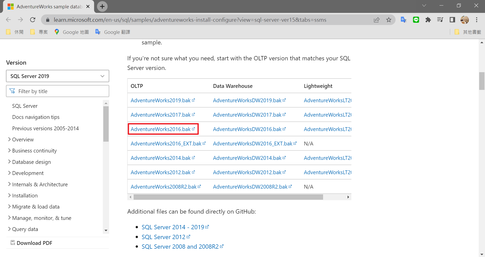
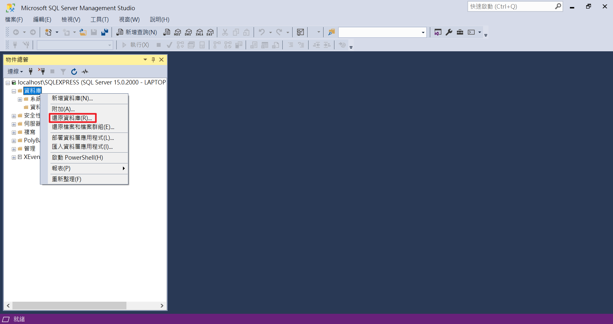
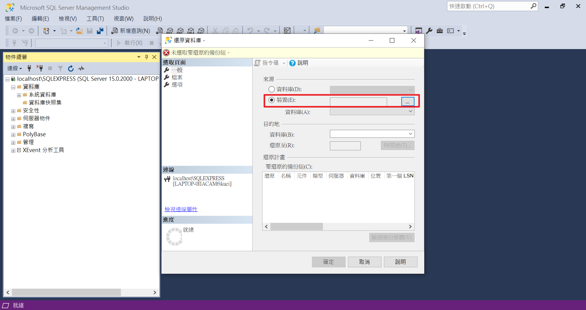
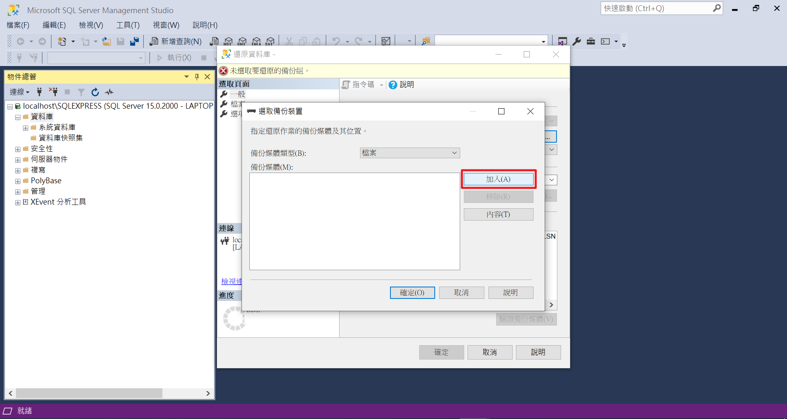
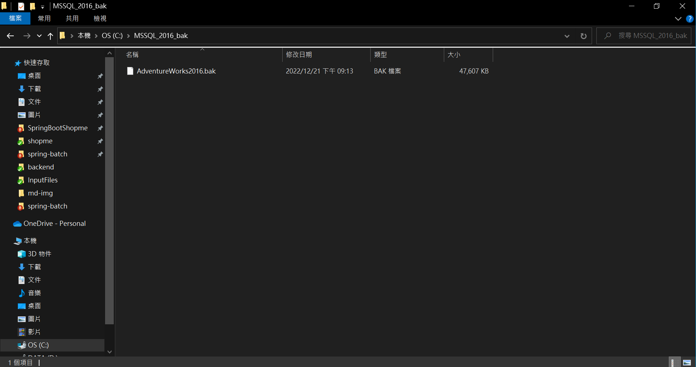
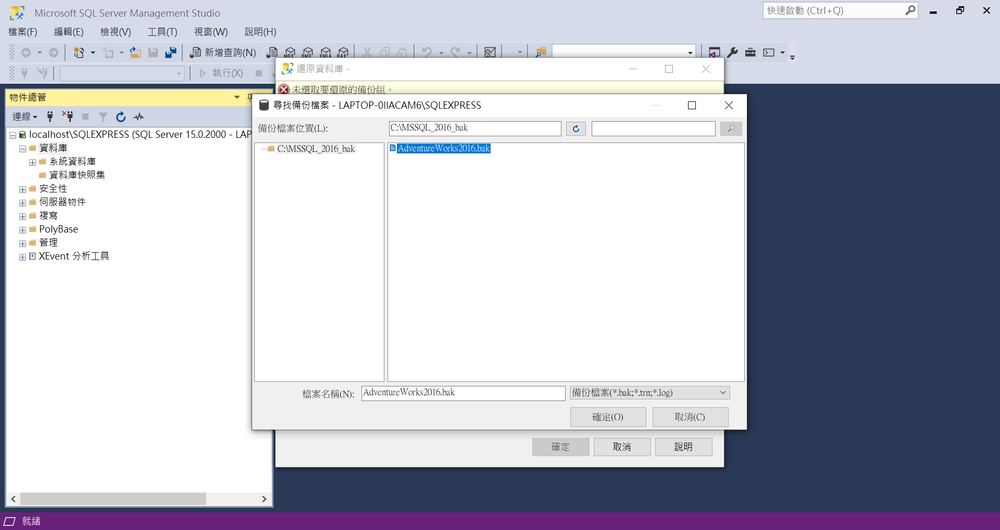
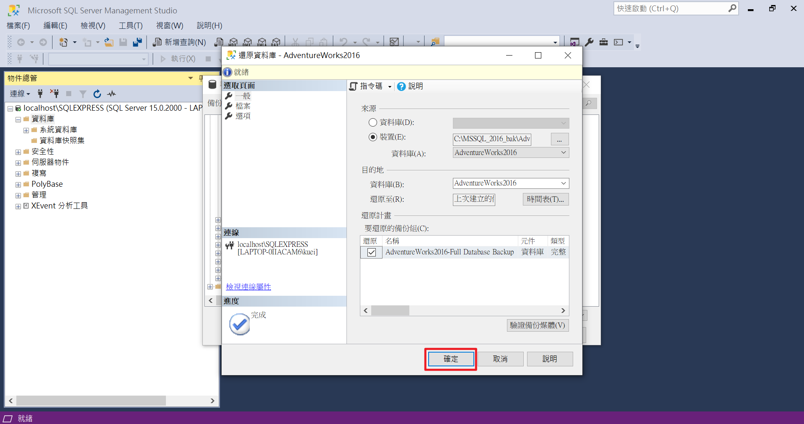
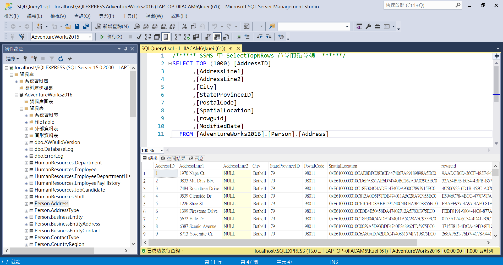

# MSSQL

## 簡介
本篇參考Udemy課程所練習之MSSQL。
## 資料庫建置
###### 1.官網下載檔案

###### 2.開啟SSMS

###### 3.還原資料庫

###### 4.匯入備份資料庫

###### 5.開啟檔案

###### 6.選擇備份資料庫

###### 7.選擇確定

###### 8.完成

## 參考
Udemy：Complete Microsoft SQL Server Database Administration Course(Imran Afzal)
